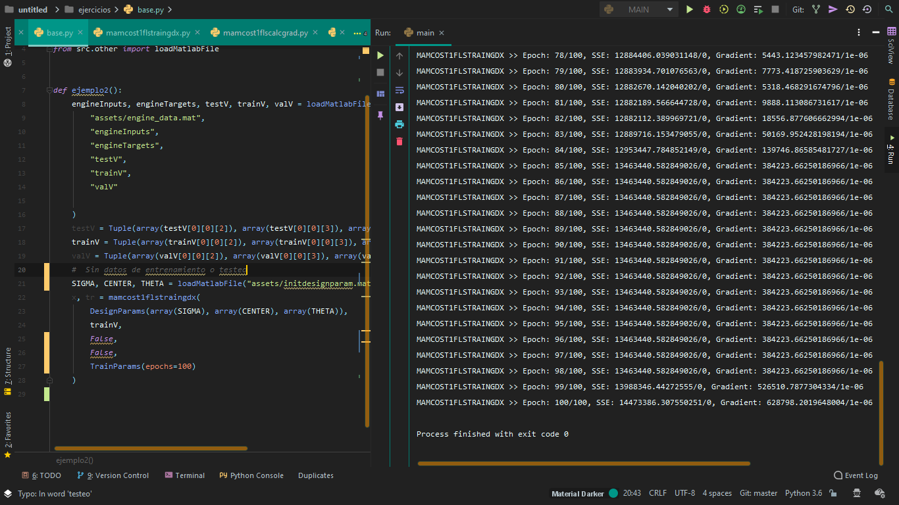
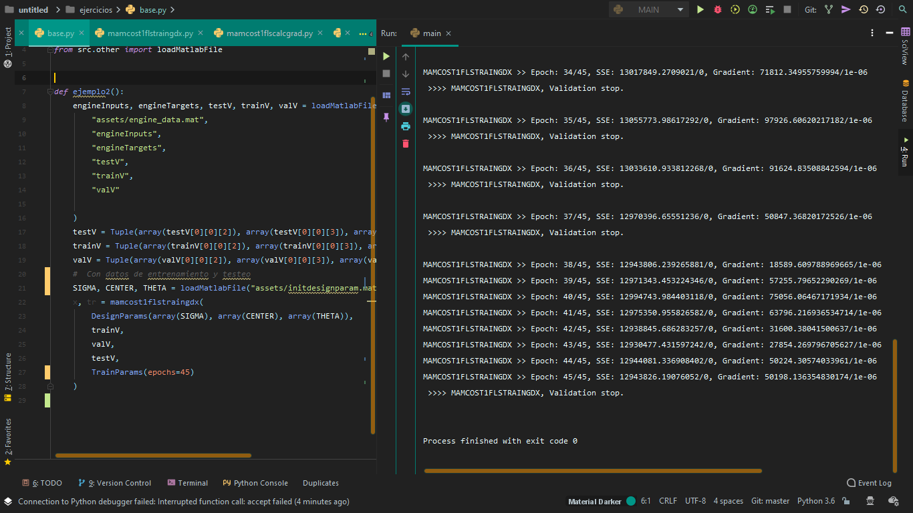
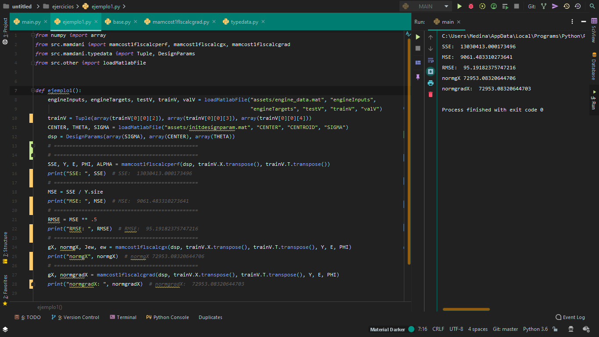

Logica difuza utilizando numpy:
* membersfunctions
    + [bellmf](src/membersfunctions/bellmf.py)
    + [sigmf](src/membersfunctions/sigmf.py)
    + [dsigmf](src/membersfunctions/dsigmf.py)
    + [psigmf](src/membersfunctions/psigmf.py)
    + [gaussmf](src/membersfunctions/gaussmf.py)
    + [gauss2mf](src/membersfunctions/gauss2mf.py)
    + [trapmf](src/membersfunctions/trapmf.py)
    + [trimf](src/membersfunctions/trimf.py)
* genfis
    + [typedata](src/genfis/typedata.py)
    + [genfis1mamcost1fls](src/genfis/genfis1mamcost1fls.py)
    + [genparamt1fls](src/genfis/genparamt1fls.py)
    + [fnnget](src/genfis/__init__.py)
    + [fnnset](src/genfis/__init__.py)
* mamdani
    + [typedata](src/mamdani/typedata.py)
    + [mamcost1flscalcgrad](src/mamdani/mamcost1flscalcgrad.py)
    + [mamcost1flscalcgx](src/mamdani/mamcost1flscalcgx.py)
    + [mamcost1flscalcperf](src/mamdani/mamcost1flscalcperf.py)
    + [mamcost1flstraingdx](src/mamdani/mamcost1flstraingdx.py)
    + [reshapeParam](src/mamdani/reshapeParam.py)
    + [vectorizeParam](src/mamdani/vectorizeParam.py)
* matrix
    + [colMatrixAugment](src/matrix/colMatrixAugment.py)
    + [reshapeVecToMatrix](src/matrix/reshapeVecToMatrix.py)
    + [vectorizeMatrixTocolVec](src/matrix/vectorizeMatrixTocolVec.py)
* other
    + [plotperf](src/other/plotperf.py)

#### Ejemplos de uso:
Se utilizaran [archivo de datos](assets) proporcionados en Matlab.

Prueba sin datos de entrenamiento y testeo:

Prueba sin datos de entrenamiento

